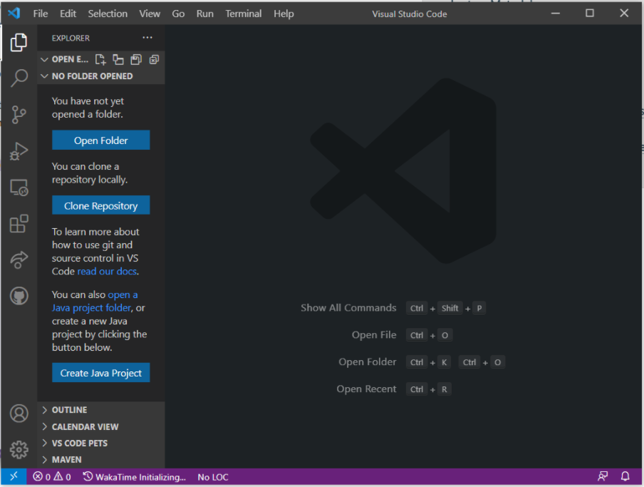
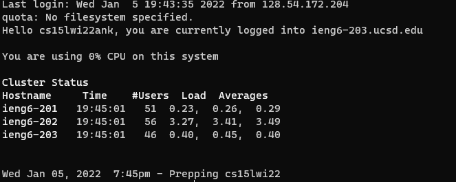
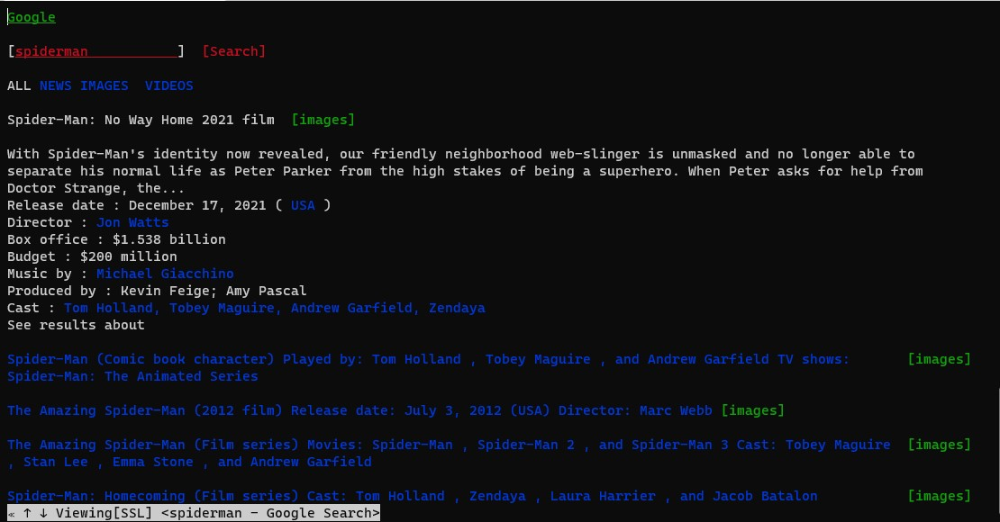
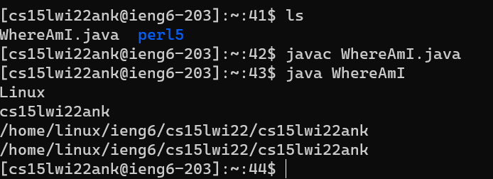
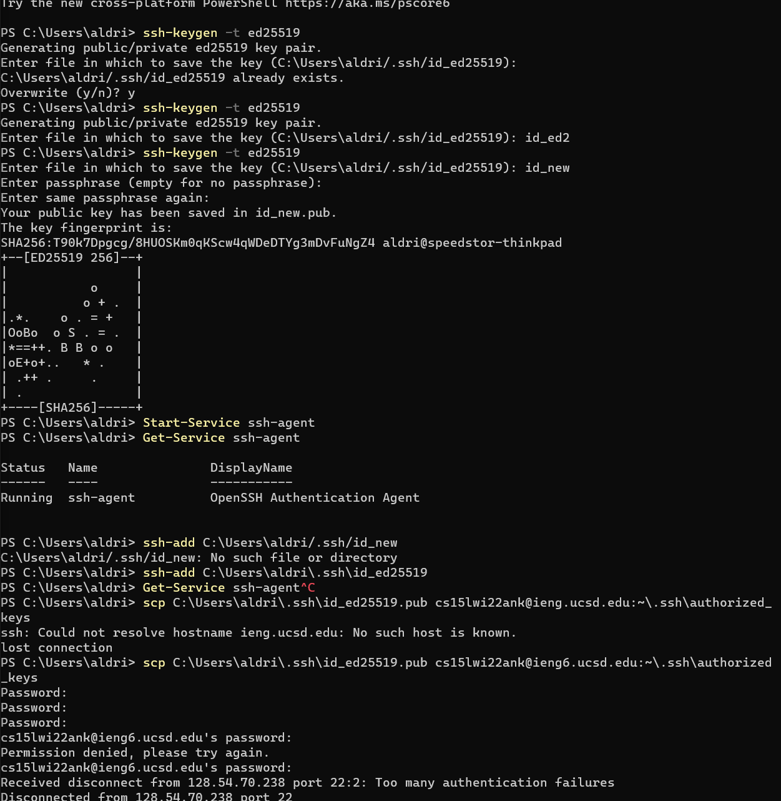
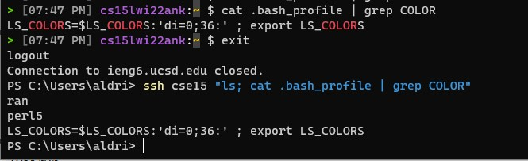

# Lab Report 1 - (week 2)

### 1: Installing VScode
- download VScode from [here](https://code.visualstudio.com/download)
- go through the installer like any other desktop programs
- open VScode like any other program



> Yay, you got your VScode setup!

### 2: Remotely Connecting
- Install openSSH in any way you want
  - for me (`windows`), I would search "manage optional features" in windows search
  - find OpenSSH Client
  - click Install if it isn't already installed
- reset cse15-lab remote account [here](https://sdacs.ucsd.edu/~icc/index.php)
  - login with the information requested
  - click a button with cse15 on it, it would read something similar to `cs15lwi22xxx` with some alterations
  - click the linke `change your password`
  - for **Change MyTritonLink**, select `No`
  - for **Change course-specific account passwords**, select `Yes`
  - if you don't get to a webpage with text saying success within half a minute, then repeat reseting the password again.
- wait for 10-15 minutes
- go to your terminal/cmd/powershell and type: `ssh cs15lxxxxxxx@ieng6.ucsd.edu`, substituting xxxxxx with the the corresponding from your button on the password reset site
- retry until the 15 minutes is up, if it still doesn't work, it means your command might be typed wrong, or that your password hasn't been reset yet, so your should redo the steps, and critically retrying things to get it to work
- when prompt to `trust a fingerprint`, type `yes` and enter
- if you see the terminal printing out the current time, you have succeded in this step



> Yay! Logged into school terminal. This is how most easy (even sometimes, advanced)-level hacking get access to computers. Though, it would be more complicated that just this

### 3: Trying Some Commands
- before computers can show pictures, typing and words are the only thing it ever was capable of
- so carried from the past, even now, we can virtually do everything from terminal, except for web-surfing
- but a lot of nerds have made tools for people to browse website from terminal, like `w3m`, `wget`, `youtube-dl`, `discord-terminal`
- some of the commands:
  - `cd`
  - `cd ~/`
  - `cd ~/.config`
  - `touch newFileName`
  - `ls`
  - `ls ~/.config`
  - `cat .bashrc`
  - `chmod +x .bashrc`
  - `source .bash_profile`
  - `echo hello`



> w3m in action. If you want to challenge your self for a month of only terminal, you can't do without w3m

### 4: Moving Files with `scp`
> to be honset, i got bored writing this guide, so here is some low effort ones coming up
- command usage `scp <source-file> <destination-file-location>`
- to indication remote file locations: `<username>@<domain/ip>:<remote-machine>`
- for example, i have a file called hello.txt in the home directory in the school remote server, and i want it in my current directory in terminal
```bash
scp cse15lwi22ank@ieng6.ucsd.edu:~/hello.txt ./
```
- then i want this file back to the remote the other way around
```bash
scp ./hello.txt cse15lwi22ank@ieng6.ucsd.edu:~/
```


> just as easy as that


### 5: Setting an SSH Key
- on windows, do this:

```powershell
ssh-keygen
# follow the prompt that follows, basically just keep pressing enter until it stops outputing stuff

Start-Service ssh-agent
Get-Service ssh-agent
ssh-add ~\.ssh\id_ed25519
```

- move the public version of the key to the school server
- to do this, go to the folder fir your id_ed25519, then shift+right click in the exploer(file folder), click open in terminal. Then, do `scp ./id_ed25519.pub cse15lxxxxxxx@ien6.ucsd.edu:~/.ssh/`

> bam, you don't need to enter your password anymore (*on this machine*)

### 6: Optimizing Remote Running
- Running commands without logging in! yayyy
- just type whatever command you want to the end of the line
- make sure if it is more than one command wrap all the commands in quote and seperate it by semi-colon `;`
- likes this
```bash
ssh cse15lxxxxxxx@ieng6.ucsd.edu "ls; cat .bash_profile | grep ls;"
```


> eyyyyyy!
