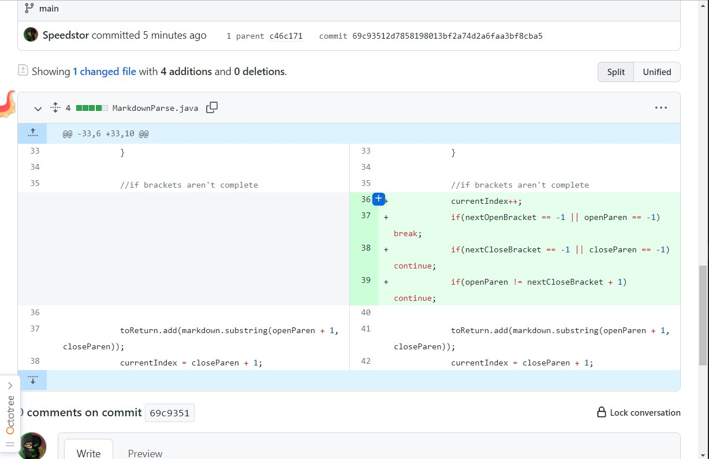
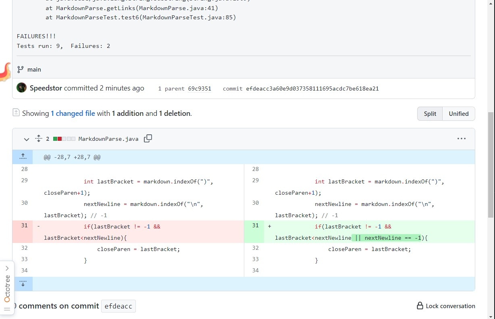
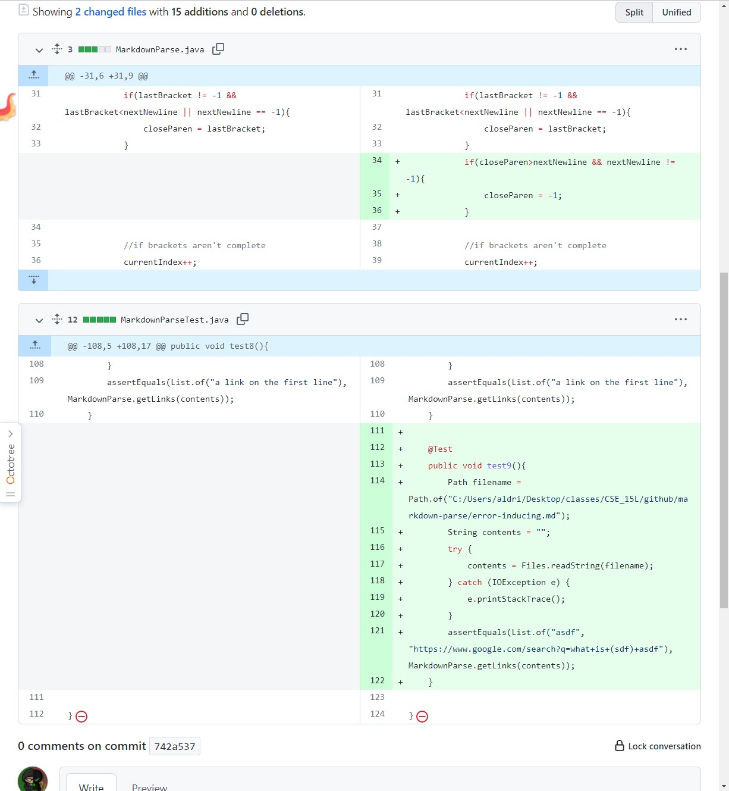

# Lab Report 1 - (week 2)
- [Lab Report 1 - (week 2)](#lab-report-1---week-2)
  - [Code Change 1](#code-change-1)
  - [Code Change 2](#code-change-2)
  - [Code Change 3](#code-change-3)

## Code Change 1
- 
- Tests Files that this fix
  - https://github.com/aldrincheung/markdown-parse/blob/main/test-file2.md
  - https://github.com/aldrincheung/markdown-parse/blob/main/test-file3.md
  - https://github.com/aldrincheung/markdown-parse/blob/main/test-file4.md
  - https://github.com/aldrincheung/markdown-parse/blob/main/test-file5.md
- Symptom
```bash
PS C:\Users\aldri\Desktop\classes\CSE_15L\github\markdown-parse> javac -cp ".;lib/junit-4.13.2.jar;lib/hamcrest-core-1.3.jar" MarkdownParseTest.java
PS C:\Users\aldri\Desktop\classes\CSE_15L\github\markdown-parse> java -cp ".;lib/junit-4.13.2.jar;lib/hamcrest-core-1.3.jar" org.junit.runner.JUnitCore MarkdownParseTest
JUnit version 4.13.2
..E.E.E.E.E.E.E.E
Time: 81.634
There were 8 failures:
1) test1(MarkdownParseTest)
java.lang.StringIndexOutOfBoundsException: begin 58, end 57, length 73
        at java.base/java.lang.String.checkBoundsBeginEnd(String.java:3720)
        at java.base/java.lang.String.substring(String.java:1909)
        at MarkdownParse.getLinks(MarkdownParse.java:37)
        at MarkdownParseTest.test1(MarkdownParseTest.java:25)
2) test2(MarkdownParseTest)
java.lang.OutOfMemoryError: Java heap space
        at java.base/java.util.Arrays.copyOfRange(Arrays.java:4031)
        at java.base/java.lang.StringLatin1.newString(StringLatin1.java:767)
        at java.base/java.lang.String.substring(String.java:1914)
        at MarkdownParse.getLinks(MarkdownParse.java:37)
        at MarkdownParseTest.test2(MarkdownParseTest.java:37)
3) test3(MarkdownParseTest)
java.lang.StringIndexOutOfBoundsException: begin 0, end -1, length 27
        at java.base/java.lang.String.checkBoundsBeginEnd(String.java:3720)
        at java.base/java.lang.String.substring(String.java:1909)
        at MarkdownParse.getLinks(MarkdownParse.java:37)
        at MarkdownParseTest.test3(MarkdownParseTest.java:49)
4) test4(MarkdownParseTest)
java.lang.StringIndexOutOfBoundsException: begin 0, end -1, length 27
        at java.base/java.lang.String.checkBoundsBeginEnd(String.java:3720)
        at java.base/java.lang.String.substring(String.java:1909)
        at MarkdownParse.getLinks(MarkdownParse.java:37)
        at MarkdownParseTest.test4(MarkdownParseTest.java:61)
5) test5(MarkdownParseTest)
java.lang.StringIndexOutOfBoundsException: begin 30, end 29, length 39
        at java.base/java.lang.String.checkBoundsBeginEnd(String.java:3720)
        at java.base/java.lang.String.substring(String.java:1909)
        at MarkdownParse.getLinks(MarkdownParse.java:37)
        at MarkdownParseTest.test5(MarkdownParseTest.java:73)
6) test6(MarkdownParseTest)
java.lang.StringIndexOutOfBoundsException: begin 18, end 17, length 27
        at java.base/java.lang.String.checkBoundsBeginEnd(String.java:3720)
        at java.base/java.lang.String.substring(String.java:1909)
        at MarkdownParse.getLinks(MarkdownParse.java:37)
        at MarkdownParseTest.test6(MarkdownParseTest.java:85)
7) test7(MarkdownParseTest)
java.lang.StringIndexOutOfBoundsException: begin 0, end -1, length 2
        at java.base/java.lang.String.checkBoundsBeginEnd(String.java:3720)
        at java.base/java.lang.String.substring(String.java:1909)
        at MarkdownParse.getLinks(MarkdownParse.java:37)
        at MarkdownParseTest.test7(MarkdownParseTest.java:97)
8) test8(MarkdownParseTest)
java.lang.OutOfMemoryError: Java heap space
        at java.base/java.lang.StringLatin1.newString(StringLatin1.java:767)
        at java.base/java.lang.String.substring(String.java:1914)
        at MarkdownParse.getLinks(MarkdownParse.java:37)
        at MarkdownParseTest.test8(MarkdownParseTest.java:109)

FAILURES!!!
Tests run: 9,  Failures: 8
```
- relationship between the bug, the symptom, and the failure-inducing input
  - The bug is that the code didn't check if the brackets are found, the symptom is that because the bug won't skip unfound brackets, it causes markdown.substring(-1, -1), which is IndexOutOfBound. The failure-inducing input is one that doesn't have complete brackets, such as "[](". **The relationship** is that a certain type of bracket doesn't exist and that the symptom would run forever searching for that non-existent bracket, and the bug isn't handling an non-existent bracket
    
<br/>
<br/>


## Code Change 2
- 
- Tests Files that this fix
  - https://github.com/aldrincheung/markdown-parse/blob/main/test-file.md
  - https://github.com/aldrincheung/markdown-parse/blob/main/test-file6.md
- Symptom
```bash
PS C:\Users\aldri\Desktop\classes\CSE_15L\github\markdown-parse> java -cp ".;lib/junit-4.13.2.jar;lib/hamcrest-core-1.3.jar" org.junit.runner.JUnitCore MarkdownParseTest 
JUnit version 4.13.2
..E.....E..
Time: 0.026
There were 2 failures:
1) test1(MarkdownParseTest)
java.lang.StringIndexOutOfBoundsException: begin 58, end 57, length 73
        at java.base/java.lang.String.checkBoundsBeginEnd(String.java:3720)
        at java.base/java.lang.String.substring(String.java:1909)
        at MarkdownParse.getLinks(MarkdownParse.java:41)
        at MarkdownParseTest.test1(MarkdownParseTest.java:25)
2) test6(MarkdownParseTest)
java.lang.StringIndexOutOfBoundsException: begin 18, end 17, length 27
        at java.base/java.lang.String.checkBoundsBeginEnd(String.java:3720)
        at java.base/java.lang.String.substring(String.java:1909)
        at MarkdownParse.getLinks(MarkdownParse.java:41)
        at MarkdownParseTest.test6(MarkdownParseTest.java:85)

FAILURES!!!
Tests run: 9,  Failures: 2
```
- relationship between the bug, the symptom, and the failure-inducing input
  - The bug was that it doesn't update the closing Param index unless it is less than the newline character, but if the line being parsed is the last line, it would not have a newline character and thus would not update the close param character, skipping it. The symptom is that the substring function have an IndexOutOfBoundException. The failure-inducing input is any bracket link to be parsed at the end of the line without a newline that comes after. **The relationship** is that the newline character not being handled are input in harmony.
  
<br/>
<br/>

## Code Change 3
- 
- Tests Files that this fix
  - https://github.com/aldrincheung/markdown-parse/blob/main/error-inducing.md
- Symptom
```bash
PS C:\Users\aldri\Desktop\classes\CSE_15L\github\markdown-parse> javac -cp ".;lib/junit-4.13.2.jar;lib/hamcrest-core-1.3.jar" MarkdownParseTest.java
PS C:\Users\aldri\Desktop\classes\CSE_15L\github\markdown-parse> java -cp ".;lib/junit-4.13.2.jar;lib/hamcrest-core-1.3.jar" org.junit.runner.JUnitCore MarkdownParseTest 
JUnit version 4.13.2
..........E
Time: 0.021
There was 1 failure:
1) test9(MarkdownParseTest)
java.lang.AssertionError: expected:<[asdf, https://www.google.com/search?q=what+is+(sdf)+asdf]> but was:<[asdf,
[asdf(adsf
[a google link](https://www.google.com/search?q=what+is+(sdf]>
        at org.junit.Assert.fail(Assert.java:89)
        at org.junit.Assert.failNotEquals(Assert.java:835)
        at org.junit.Assert.assertEquals(Assert.java:120)
        at org.junit.Assert.assertEquals(Assert.java:146)
        at MarkdownParseTest.test9(MarkdownParseTest.java:121)

FAILURES!!!
Tests run: 10,  Failures: 1
```
- relationship between the bug, the symptom, and the failure-inducing input
  - The bug is that it doesn't check if the link is multi-lined, and because a multi-line link shouldn't exist, it shouldn't be included. The symptom is that multi-line links are included, and the failure-inducing input is a multi-line link. **The relationship** is that multi-lined link isn't expected, and that the input includes one, so to fix it it is to check if the link includes a newline character
  - 