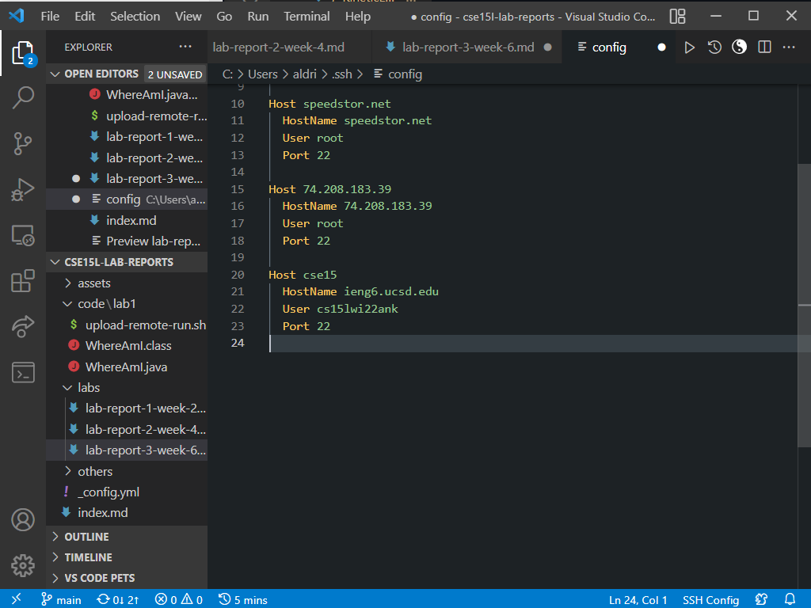
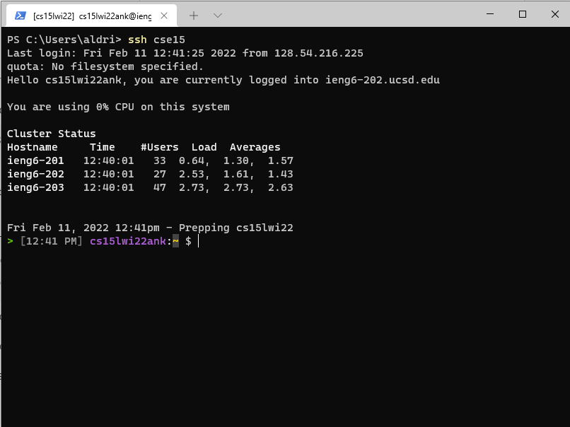
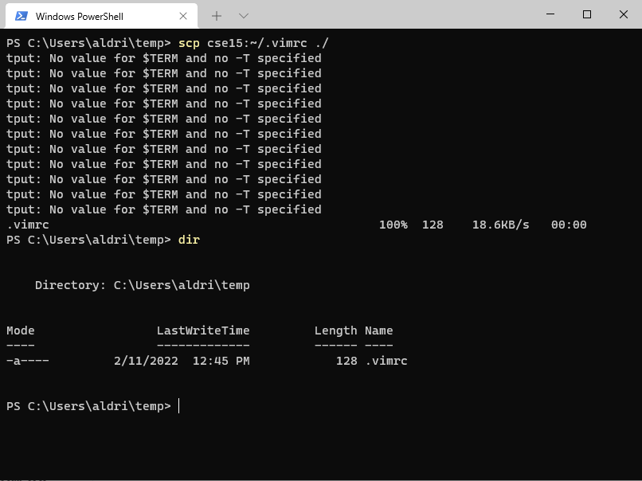

# Lab Report 3 - (week 6)

I'm doing **Streamlining ssh Configuration** option.

### Streamlining ssh Configuration
- For the ssh config file, I didn't need to specify the identity file key location because I have added it to my key ssh-agent, and that is the default one

- The following is a screenshot to ssh to remote lab account

- The following is a screenshot of a scp to the remote lab account

- The warning for "tput: No value for $TERM and no -T specified" is an error about my terminal on windows and that they can't detect the terminal window width, I will fix that later :)

- Overall this lab was great, having an alias for sshing to my remote account saved me from remembering the hostname and account-name for my remote machine which would change every quater anyways.